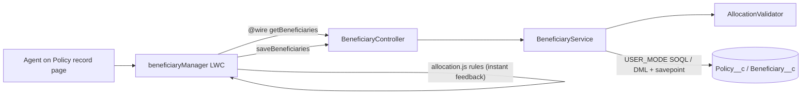

# Policy Beneficiary Manager (Salesforce LWC + Apex)

[](https://github.com/Mounika-Mangiri/sf-policy-beneficiary-manager/actions/workflows/ci.yml)

A Lightning Web Component that lets an insurance servicing agent view and change the primary and contingent beneficiaries on a policy, with allocation rules enforced in the browser and again on the server.

> **Representative portfolio project.** Written independently with synthetic data to demonstrate the kind of servicing work done on Salesforce in insurance and retirement. It contains no employer or client code, data, object names or configuration. It uses its own custom objects (`Policy__c`, `Beneficiary__c`) and is not a Financial Services Cloud package.

## Business problem

Beneficiary changes are one of the most common life and annuity service requests, and mistakes are costly: allocations that do not add up to 100% get rejected downstream or, worse, paid out wrong. Agents need one screen that:

- shows current primary and contingent beneficiaries,
- blocks a save until each designation group totals exactly 100%,
- saves all changes together or not at all,
- respects the agent's object, field and record access.

## What this demonstrates

| Area | Where |
| --- | --- |
| Lightning Web Components: wire + imperative Apex, `refreshApex`, toasts, dynamic rows | `lwc/beneficiaryManager` |
| Shared client-side rule module with Jest tests | `lwc/beneficiaryManager/allocation.js` |
| Service-layer Apex with user-mode SOQL and DML (`WITH USER_MODE`, `AccessLevel.USER_MODE`) | `BeneficiaryService.cls` |
| All-or-nothing save with savepoint and rollback | `BeneficiaryService.applyPlan` |
| Pure, testable validation logic | `AllocationValidator.cls` |
| Apex tests: positive, negative, permission (`System.runAs`), cross-policy tampering | `*Test.cls` |
| Least-privilege permission set | `permissionsets/Beneficiary_Manager` |
| CI: Prettier (parses Apex), Jest with coverage gate, PMD, optional scratch-org Apex tests | `.github/workflows/ci.yml` |

## Architecture



Validation runs twice on purpose: the LWC gives instant feedback, and the server rejects anything that slips past the UI (for example, a direct API call).

## Data model

| Object | Field | Type | Notes |
| --- | --- | --- | --- |
| `Policy__c` | Name | Text | Policy number |
| | `Product_Type__c` | Picklist | Term Life, Whole Life, Fixed Annuity |
| | `Status__c` | Picklist | Active, Lapsed, Surrendered |
| | `Policyholder_Name__c` | Text | Synthetic |
| `Beneficiary__c` | `Policy__c` | Master-detail | Sharing controlled by parent |
| | `Full_Name__c` | Text (required) | |
| | `Relationship__c` | Picklist | |
| | `Designation__c` | Picklist | Primary, Contingent |
| | `Allocation_Percent__c` | Number(5,2) | 50 = 50% |

## Run it

Prerequisites: Node 20+, Java 21 (for the Apex Prettier parser and PMD), and for org deployment the [Salesforce CLI](https://developer.salesforce.com/tools/salesforcecli) with a Dev Hub.

```bash
npm install
npm test                 # LWC Jest tests
npm run test:coverage    # with coverage thresholds
npm run prettier:check   # formatting; also proves every Apex class parses
```

Deploy to a scratch org, load synthetic data and run Apex tests:

```bash
./scripts/setup-scratch-org.sh beneficiary-demo
```

Then open a Policy record, click **Edit Page**, drag **Beneficiary Manager** onto the layout and save.

## Tests

| Suite | Count | Covers |
| --- | --- | --- |
| Jest `allocation.test.js` | 8 | totals without float drift, every rule, even split, error reducer |
| Jest `beneficiaryManager.test.js` | 7 | render, empty state, wire error, blocked save, successful save payload, server error toast, row removal |
| Apex `AllocationValidatorTest` | 7 | each validation rule |
| Apex `BeneficiaryServiceTest` | 7 | insert/update/delete in one save, rollback on invalid input, foreign-Id tampering, no-access user, permission-set user |
| Apex `BeneficiaryControllerTest` | 3 | round trip and error mapping |

Jest results (local run): 15 passed, 96% statement coverage. Apex tests run in a scratch org via the script above or the CI job.

## Security notes

- Every query and DML runs in **user mode**, so field-level security, object permissions and sharing are enforced; nothing escalates to system mode.
- The service copies only editable fields from client input, so a caller cannot set `Policy__c` or other fields on an existing row.
- A beneficiary Id that belongs to a different policy is rejected.
- No credentials, named credentials or org-specific Ids are stored in the repo. The CI org job reads its Dev Hub auth URL from a GitHub secret.

## Limitations and next steps

- Standalone custom objects; a production FSC build would relate beneficiaries to `FinancialAccount` and person accounts instead.
- No audit trail beyond field history; a regulated build would add a change-request record and approval step.
- Percent-only allocation; some products need fixed-amount or per-stirpes options.
- Add an Experience Cloud variant so policyholders can submit changes for agent review.

## Credits

Designed and maintained by Mounika M. Code drafted with AI assistance and reviewed by the author. Licensed under MIT.
